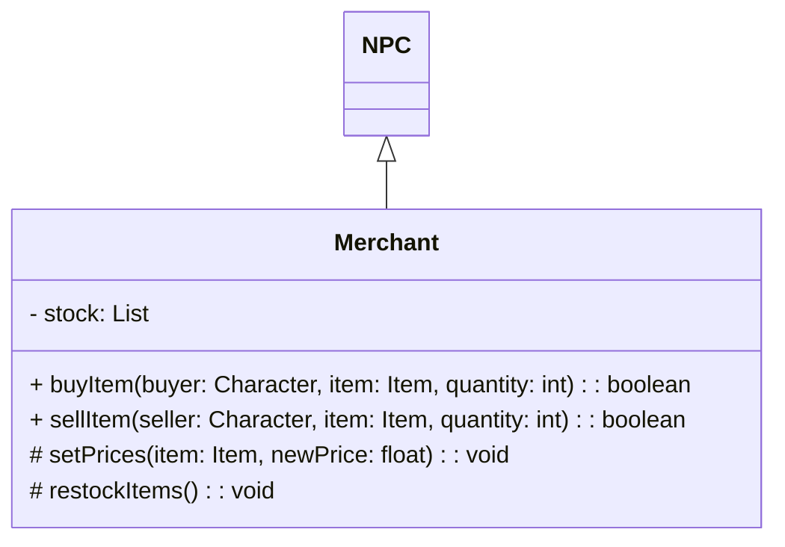

```mermaid
classDiagram
    NPC <|-- Merchant
    
    class Merchant {
        - stock: List<Item>
        + buyItem(buyer: Character, item: Item, quantity: int): boolean
        + sellItem(seller: Character, item: Item, quantity: int): boolean
        # setPrices(item: Item, newPrice: float): void
        # restockItems(): void
    }
```
