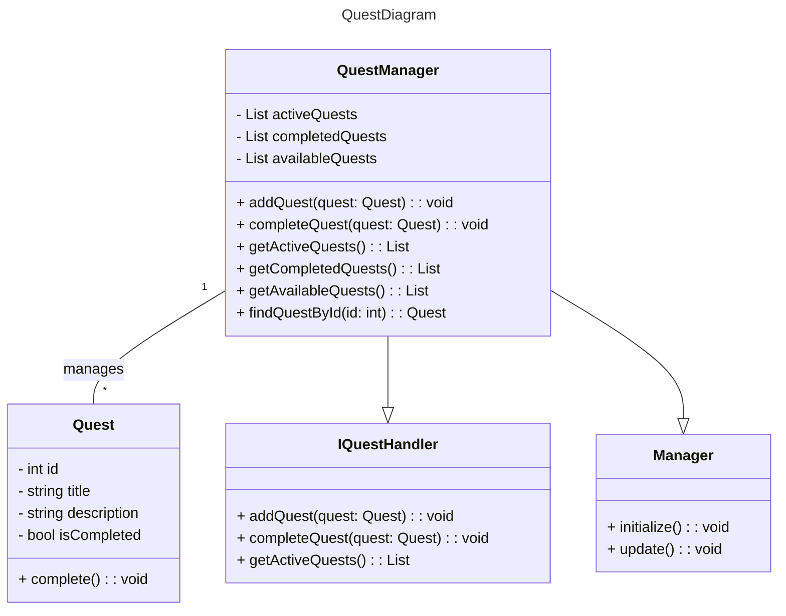

```mermaid
---
title: QuestDiagram
---
classDiagram
    class QuestManager {
        - List<Quest> activeQuests
        - List<Quest> completedQuests
        - List<Quest> availableQuests
        + addQuest(quest: Quest): void
        + completeQuest(quest: Quest): void
        + getActiveQuests(): List<Quest>
        + getCompletedQuests(): List<Quest>
        + getAvailableQuests(): List<Quest>
        + findQuestById(id: int): Quest
    }

    class Quest {
        - int id
        - string title
        - string description
        - bool isCompleted
        + complete(): void
    }

    class IQuestHandler {
        + addQuest(quest: Quest): void
        + completeQuest(quest: Quest): void
        + getActiveQuests(): List<Quest>
    }

    class Manager {
        + initialize(): void
        + update(): void
    }

    QuestManager "1" -- "*" Quest : manages
    QuestManager --|> IQuestHandler
    QuestManager --|> Manager
```

