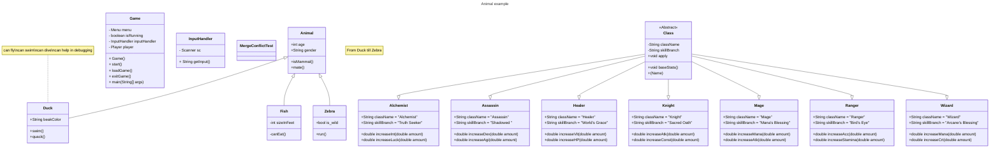

```mermaid
---
title: Animal example
---
classDiagram
    note "From Duck till Zebra"
    Animal <|-- Duck
    note for Duck "can fly\ncan swim\ncan dive\ncan help in debugging"
    Animal <|-- Fish
    Animal <|-- Zebra
    Animal : +int age
    Animal : +String gender
    Animal: +isMammal()
    Animal: +mate()
    class Duck{
        +String beakColor
        +swim()
        +quack()
    }
    class Fish{
        -int sizeInFeet
        -canEat()
    }
    class Zebra{
        +bool is_wild
        +run()
    }

    class Game{
        - Menu menu
        - boolean isRunning
        - InputHandler inputHandler
        - Player player
        + Game()
        + start()
        + loadGame()
        + exitGame()
        + main(String[] args)
    }

    class InputHandler{
        - Scanner sc
        + String getInput()

    }
    
    class MergeConflictTest{

    }

    class Alchemist {
        +String className = "Alchemist"
        +String skillBranch = "Truth Seeker"
        +double increaseInt(double amount)
        +double increaseLuck(double amount)
    }
    class Assassin {
        +String className = "Assassin"
        +String skillBranch = "Shadowed "
        +double increaseDex(double amount)
        +double increaseAgi(double amount)
    }
    class Healer {
        +String className = "Healer"
        +String skillBranch = "World's Grace"
        +double increaseVit(double amount)
        +double increaseHP(double amount)
    }
    class Knight {
        +String className = "Knight"
        +String skillBranch = "Sacred Oath"
        +double increaseAtk(double amount)
        +double increaseConst(double amount)
    }
    class Mage {
        +String className = "Mage"
        +String skillBranch = "Mana's Blessing"
        +double increaseMana(double amount)
        +double increaseAtk(double amount)
    }
    class Ranger {
        +String className = "Ranger"
        +String skillBranch = "Bird's Eye"
        +double increaseAcc(double amount)
        +double increaseStamina(double amount)
    }
    class Wizard {
        +String className = "Wizard"
        +String skillBranch = "Arcane's Blessing"
        +double increaseMana(double amount)
        +double increaseCrt(double amount)
    }

    Class --|> Alchemist
    Class --|> Assassin
    Class --|> Healer
    Class --|> Knight
    Class --|> Mage
    Class --|> Ranger
    Class --|> Wizard


    class Class {
        <<Abstract>>
        -String className
        -String skillBranch
        +void baseStats()
        +void apply
	    +(Name)
    }
```