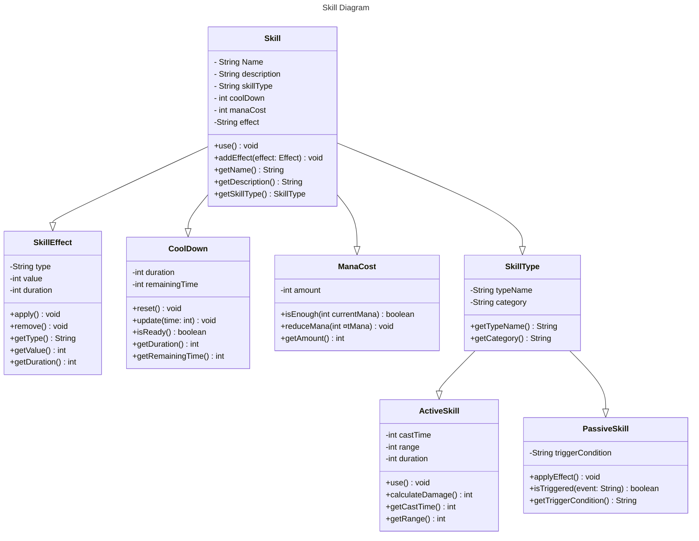

```mermaid
---
title: Skill Diagram
---
classDiagram
direction TB
    class SkillEffect {
	    -String type  
        -int value
        -int duration
        +apply() void
        +remove() void
        +getType() String
        +getValue() int
        +getDuration() int
    }
    class CoolDown {
	    -int duration
        -int remainingTime
        +reset() void
        +update(time: int) void
        +isReady() boolean
        +getDuration() int
        +getRemainingTime() int
    }
    class ManaCost {
	    -int amount
        +isEnough(int currentMana) boolean
        +reduceMana(int &currentMana) void
        +getAmount() int
    }
    class SkillType {
	    -String typeName 
        -String category 
        +getTypeName() String
        +getCategory() String
    }
    class Skill {
	    - String Name
	    - String description
	    - String skillType
	    - int coolDown
	    - int manaCost
	    -String effect
        +use() void
        +addEffect(effect: Effect) void
        +getName() String
        +getDescription() String
        +getSkillType() SkillType
    }
    class ActiveSkill {
        -int castTime
        -int range
        -int duration
        +use() void
        +calculateDamage() int
        +getCastTime() int
        +getRange() int
    }

    class PassiveSkill {
        -String triggerCondition
        +applyEffect() void
        +isTriggered(event: String) boolean
        +getTriggerCondition() String
    }
    Skill --|> SkillEffect
    Skill --|> CoolDown
    Skill --|> ManaCost
    Skill --|> SkillType
    SkillType --|> ActiveSkill
    SkillType --|> PassiveSkill
```
