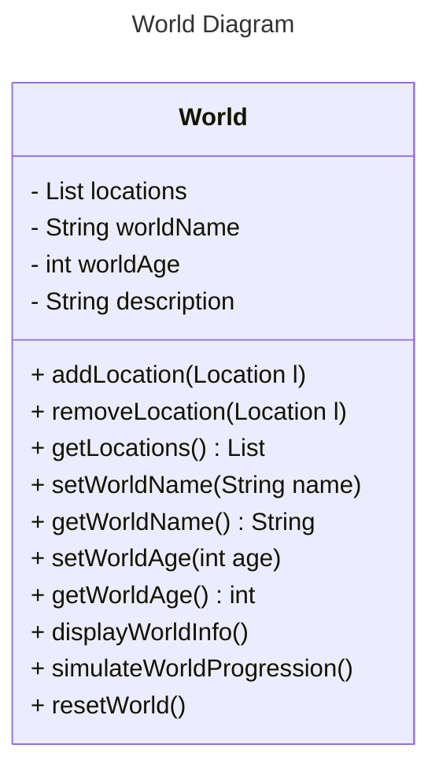

```mermaid
---
title: World Diagram
---
classDiagram
    class World {
        - List locations
        - String worldName
        - int worldAge
        - String description
        + addLocation(Location l)
        + removeLocation(Location l)
        + getLocations() List
        + setWorldName(String name)
        + getWorldName() String
        + setWorldAge(int age)
        + getWorldAge() int
        + displayWorldInfo()
        + simulateWorldProgression()
        + resetWorld()
    }
```

