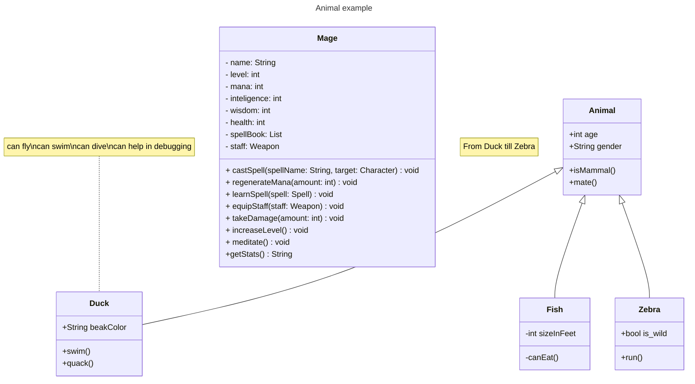

```mermaid
---
title: Animal example
---
classDiagram
    note "From Duck till Zebra"
    Animal <|-- Duck
    note for Duck "can fly\ncan swim\ncan dive\ncan help in debugging"
    Animal <|-- Fish
    Animal <|-- Zebra
    Animal : +int age
    Animal : +String gender
    Animal: +isMammal()
    Animal: +mate()
    class Duck{
        +String beakColor
        +swim()
        +quack()
    }
    class Fish{
        -int sizeInFeet
        -canEat()
    }
    class Zebra{
        +bool is_wild
        +run()
    }

class Mage {
    - name: String
    - level: int
    - mana: int
    - inteligence: int
    - wisdom: int
    - health: int
    - spellBook: List<Spell>
    - staff: Weapon
    + castSpell(spellName: String, target: Character)void
    + regenerateMana(amount: int)void
    + learnSpell(spell: Spell)void
    + equipStaff(staff: Weapon)void
    + takeDamage(amount: int)void
    + increaseLevel()void
    + meditate()void
    +getStats()String
}
```
