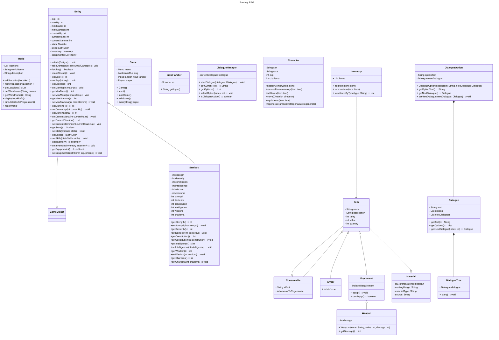

```mermaid
---
title: Fantasy RPG
---
classDiagram
    class World {
        - List locations
        - String worldName
        - String description
        + addLocation(Location l)
        + removeLocation(Location l)
        + getLocations() List
        + setWorldName(String name)
        + getWorldName() String
        + displayWorldInfo()
        + simulateWorldProgression()
        + resetWorld()
   }

   Entity --|> GameObject
   class Entity{
      - exp: int
      - maxHp: int
      - maxMana: int
      - maxStamina: int
      - currentHp: int
      - currentMana: int
      - currentStamina: int
      - stats: Statistic
      - skills: List~Skill~
      - inventory: Inventory
      - equipments: List~Item~
      + attack(Entity e): void
      + takeDamage(int amountOfDamage): void
      + isAlive (): boolean
      + makeSound(): void
      + getExp() : int
      + setExp(int exp): void
      + getMaxHp(): int
      + setMaxHp(int maxHp): void
      + getMaxMana(): int
      + setMaxMana(int maxMana): void
      + getMaxStamina(): int
      + setMaxStamina(int maxStamina): void
      + getCurrentHp(): int
      + setCurrentHp(int currentHp): void
      + getCurrentMana(): int
      + setCurrentMana(int currentMana): void
      + getCurrentStamina(): int
      + setCurrentStamina(int currentStamina): void
      + getStats(): Statistic
      + setStats(Statistic stats): void
      + getSkills(): List~Skill~
      + setSkills(List~Skill~ skills): void
      + getInventory(): Inventory
      + setInventory(Inventory inventory): void
      + getEquipments(): List~Item~
      + setEquipments(List~Item~ equipments): void

    }

    class Material {
        - isCraftingMaterial: boolean
        - craftingUsage: String
        - materialType: String
        - source: String
    }

    class Item {
        - String name
        - String description
        - int rarity
        - int value
        - int quantity   
    }

    class Statistic {
        - int strength
        - int dexterity
        - int constitution
        - int intelligence
        - int wisdom
        - int charisma
    }

    Entity o-- Statistic
    class Statistic{
	-int strength
	-int dexterity
	-int constitution
	-int intelligence
	-int wisdom
	-int charisma
        +getStrength(): int
        +setStrength(int strength): void
        +getDexterity(): int
        +setDexterity(int dexterity): void
        +getConstitution(): int
        +setConstitution(int constitution): void
        +getIntelligence(): int
        +setIntelligence(int intelligence): void
        +getWisdom(): int
        +setWisdom(int wisdom): void
        +getCharisma(): int
        +setCharisma(int charisma): void
  }

    Item --|> Consumable
    class Consumable {
        - String effect
        - int amountToRegenerate 
    }

    class Armor {
        + int defense
    }

    class Game {
        - Menu menu
        - boolean isRunning
        - InputHandler inputHandler
        - Player player
        + Game()
        + start()
        + loadGame()
        + exitGame()
        + main(String[] args)
    }

    class InputHandler {
        - Scanner sc
        + String getInput()
    }

    class DialogueManager {
        - currentDialogue: Dialogue
        + startDialogue(dialogue: Dialogue): void
        + getCurrentText(): String
        + getOptions(): List<String>
        + selectOption(index: int): void
        + isDialogueActive(): boolean
    } 

    class DialogueTree {
        - Dialogue dialogue
        + start(): void
    }

    class Dialogue {
        - String text
        - List<String> options
        - List<Dialogue> nextDialogues
        + getText(): String
        + getOptions(): List<String>
        + getNextDialogue(index: int): Dialogue
    }

    class Character{
     -String sex
     -String race
     -int exp
     -int charisma
     +addtoInventory(Item item)
     +removeFromInventory(Item item)
     +sellItems(Item item)
     +move(Direction direction)
     +equipItems(Item item)
     +regenerate(amountToRegenarate regenerate)
    }

    class DialogueOption {
        - String optionText
        - Dialogue nextDialogue
        + DialogueOption(optionText: String, nextDialogue: Dialogue)
        + getOptionText(): String
        + getNextDialogue(): Dialogue
        + setNextDialogue(nextDialogue: Dialogue): void
    }

    class Equipment {
        - int levelRequirement
        + equip(): void
        + canEquip(): boolean
    }

    class Weapon {
        - int damage
        + Weapon(name: String, value: int, damage: int)
        + getDamage(): int
    }

    class Inventory {
        + List<Item> items
        + addItem(item: Item)
        + removeItem(item: Item)
        + viewItemsByType(type: String): List<Item>
    } 

    Item <|-- Consumable
    Item <|-- Armor
    Item <|-- Equipment
    Equipment <|-- Weapon
    Inventory --> Item 
    Item --|> Material
    Dialogue *-- DialogueTree 
    DialogueOption *-- Dialogue
```

