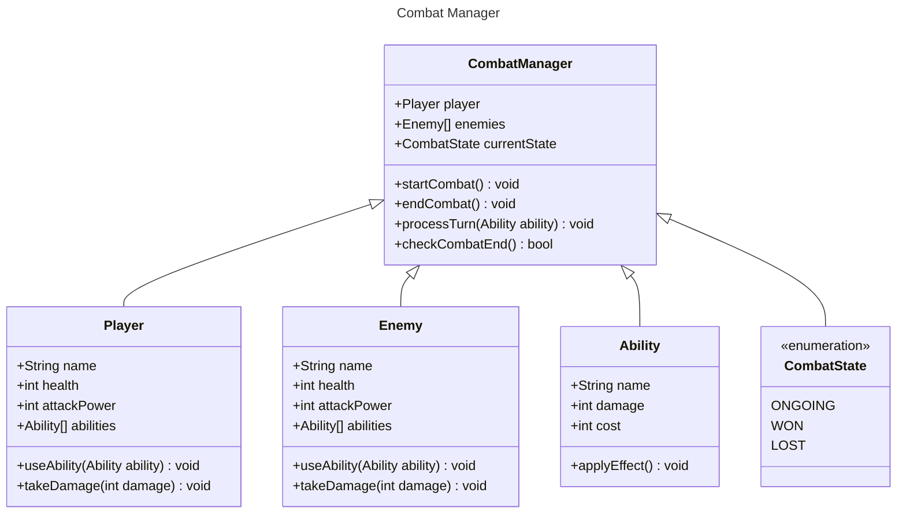

```mermaid
---
title: Combat Manager
---
classDiagram
    Combat Manager <|-- Player
    Combat Manager <|-- Enemy
    Combat Manager <|-- Ability
    Combat Manager <|-- CombatState
    Combat Manager : +Player player
    Combat Manager : +Enemy[] enemies
    Combat Manager: +CombatState currentState
    Combat Manager: +startCombat() void
    Combat Manager: +endCombat() void
    Combat Manager: +processTurn(Ability ability) void
    Combat Manager: +checkCombatEnd() bool
    class Player {
    	+String name
        +int health
        +int attackPower
        +Ability[] abilities
        +useAbility(Ability ability) void
        +takeDamage(int damage) void 
    }
    class Enemy {
        +String name
        +int health
        +int attackPower
        +Ability[] abilities
        +useAbility(Ability ability) void
        +takeDamage(int damage) void
    }
    class Ability {
        +String name
        +int damage
        +int cost
        +applyEffect() void
    }
    class CombatState {
       <<enumeration>>
        ONGOING
        WON
        LOST
    }
```