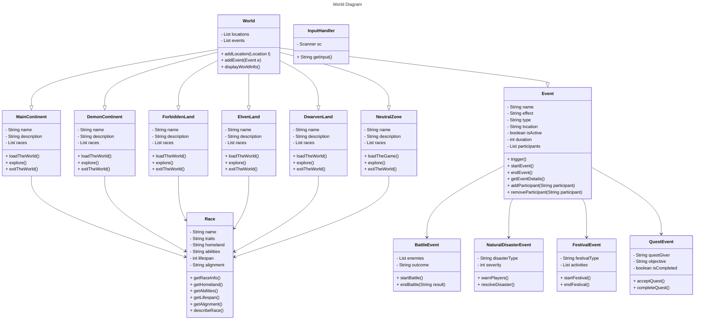

```mermaid
---
title: World Diagram
---
classDiagram
direction TB
    class World {
        - List locations
        - List events
        + addLocation(Location l)
        + addEvent(Event e)
        + displayWorldInfo()
    }
    class MainContinent {
        - String name
        - String description
        - List races
        + loadTheWorld()
        + explore()
        + exitTheWorld()
    }
    class DemonContinent {
        - String name
        - String description
        - List races
        + loadTheWorld()
        + explore()
        + exitTheWorld()
    }
    class ForbiddenLand {
        - String name
        - String description
        - List races
        + loadTheWorld()
        + explore()
        + exitTheWorld()
    }
    class ElvenLand {
        - String name
        - String description
        - List races
        + loadTheWorld()
        + explore()
        + exitTheWorld()
    }
    class DwarvenLand {
        - String name
        - String description
        - List races
        + loadTheWorld()
        + explore()
        + exitTheWorld()
    }
    class NeutralZone {
        - String name
        - String description
        - List races
        + loadTheGame()
        + explore()
        + exitTheWorld()
    }
    class Event {
        - String name
        - String effect
        - String type
        - String location
        - boolean isActive
        - int duration
        - List<String> participants
        + trigger()
        + startEvent()
        + endEvent()
        + getEventDetails()
        + addParticipant(String participant)
        + removeParticipant(String participant)
    }
    class BattleEvent {
    - List<String> enemies
    - String outcome
    + startBattle()
    + endBattle(String result)
    }

    class NaturalDisasterEvent {
    - String disasterType
    - int severity
    + warnPlayers()
    + resolveDisaster()
    }

    class FestivalEvent {
    - String festivalType
    - List<String> activities
    + startFestival()
    + endFestival()
    }

    class QuestEvent {
    - String questGiver
    - String objective
    - boolean isCompleted
    + acceptQuest()
    + completeQuest()
    }

    class Race {
        - String name
        - String traits
        - String homeland
        - String abilities
        - int lifespan
        - String alignment
        + getRaceInfo()
        + getHomeland()
        + getAbilities()
        + getLifespan()
        + getAlignment()
        + describeRace()
    }

    World --|> MainContinent
    World --|> DemonContinent
    World --|> ForbiddenLand
    World --|> ElvenLand
    World --|> DwarvenLand
    World --|> Event
    World --|> NeutralZone 
    MainContinent --> Race
    DemonContinent --> Race
    ForbiddenLand --> Race
    ElvenLand --> Race
    DwarvenLand --> Race
    NeutralZone --> Race
    Event --> BattleEvent
    Event --> NaturalDisasterEvent
    Event --> FestivalEvent
    Event --> QuestEvent

    class InputHandler{
        - Scanner sc
        + String getInput()
    }
```

