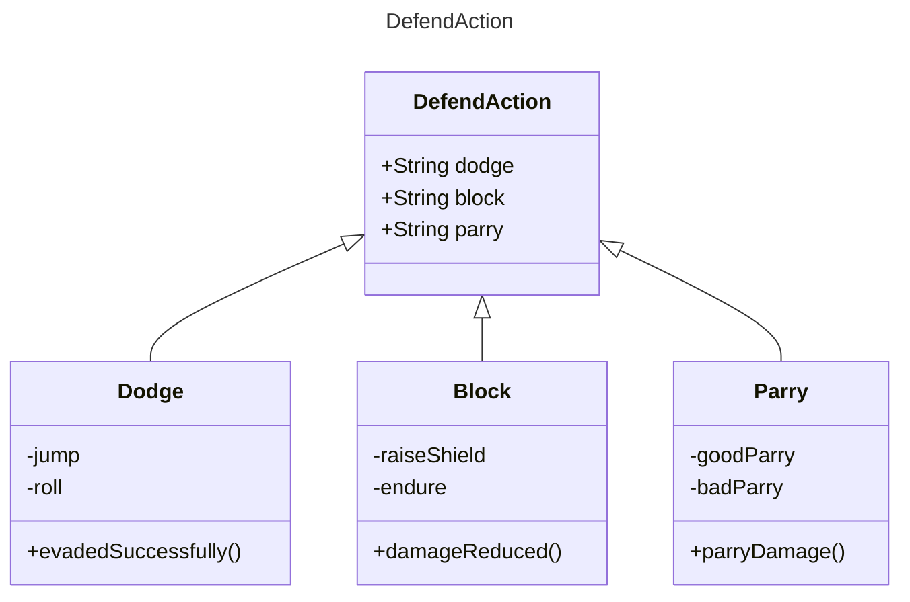

```mermaid
---
title: DefendAction
---
classDiagram
DefendAction <|-- Dodge
DefendAction <|-- Block
DefendAction <|-- Parry
DefendAction: +String dodge
DefendAction: +String block
DefendAction: +String parry
class Dodge{
-jump
-roll
+evadedSuccessfully()
}
class Block{
-raiseShield
-endure
+damageReduced()
}
class Parry{
-goodParry
-badParry
+parryDamage()
}

```
