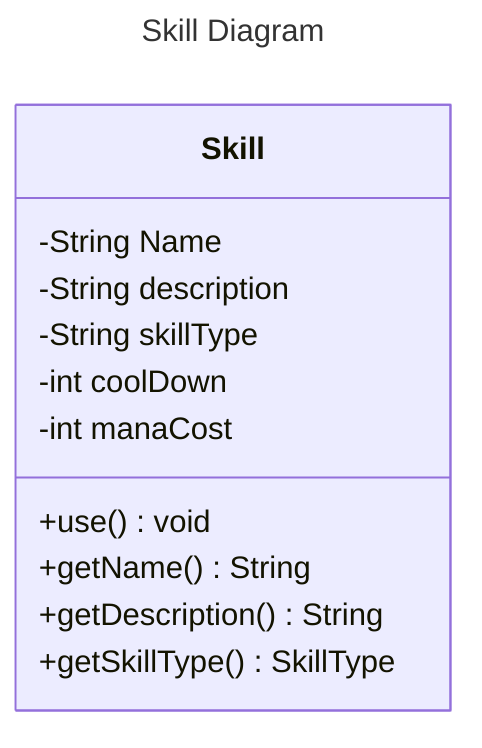

```mermaid
---
title: Skill Diagram
---
classDiagram
direction TB
    
    class Skill {
	    -String Name
	    -String description
	    -String skillType
	    -int coolDown
	    -int manaCost
        +use() void
        +getName() String
        +getDescription() String
        +getSkillType() SkillType
    }
```
