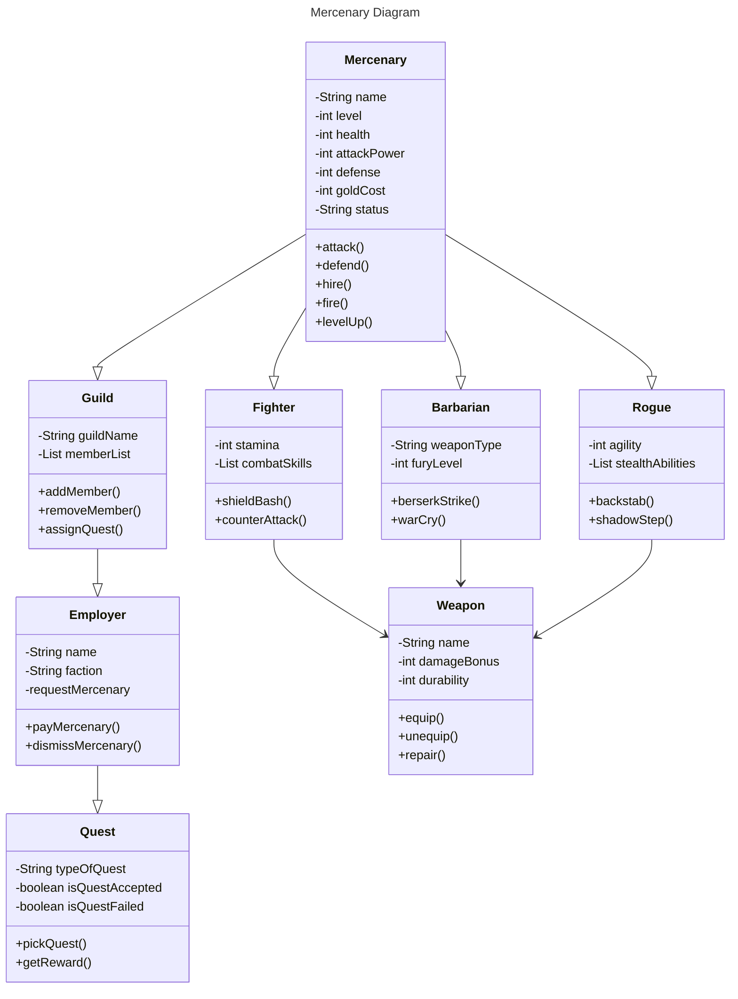

```mermaid
---
title: Mercenary Diagram
---

classDiagram
    direction TB
    class Mercenary {
        -String name
        -int level
        -int health
        -int attackPower
        -int defense
        -int goldCost
        -String status
        +attack()
        +defend()
        +hire()
        +fire()
        +levelUp()
    }

    class Fighter {
        -int stamina
        -List combatSkills
        +shieldBash()
        +counterAttack()
    }

    class Barbarian {
        -String weaponType
        -int furyLevel
        +berserkStrike()
        +warCry()
    }

    class Rogue {
        -int agility
        -List stealthAbilities
        +backstab()
        +shadowStep()
    }

    class Employer {
        -String name
        -String faction
        -requestMercenary
        +payMercenary()
        +dismissMercenary()
    }

    class Weapon {
        -String name
        -int damageBonus
        -int durability
        +equip()
        +unequip()
        +repair()
    }

    class Guild {
        -String guildName
        -List memberList
        +addMember()
        +removeMember()
        +assignQuest()
    }

    class Quest {
        -String typeOfQuest
        -boolean isQuestAccepted
        -boolean isQuestFailed
        +pickQuest()
        +getReward()
    }

    Mercenary --|> Fighter
    Mercenary --|> Barbarian
    Mercenary --|> Rogue
    Mercenary --|> Guild
    Guild --|> Employer
    Employer --|> Quest
    Fighter --> Weapon
    Barbarian --> Weapon
    Rogue --> Weapon
```
