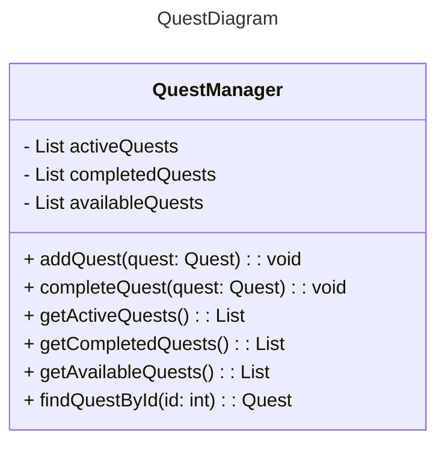

```mermaid
---
title: QuestDiagram
---
classDiagram
    class QuestManager {
        - List<Quest> activeQuests
        - List<Quest> completedQuests
        - List<Quest> availableQuests
        + addQuest(quest: Quest): void
        + completeQuest(quest: Quest): void
        + getActiveQuests(): List<Quest>
        + getCompletedQuests(): List<Quest>
        + getAvailableQuests(): List<Quest>
        + findQuestById(id: int): Quest
    }
```

