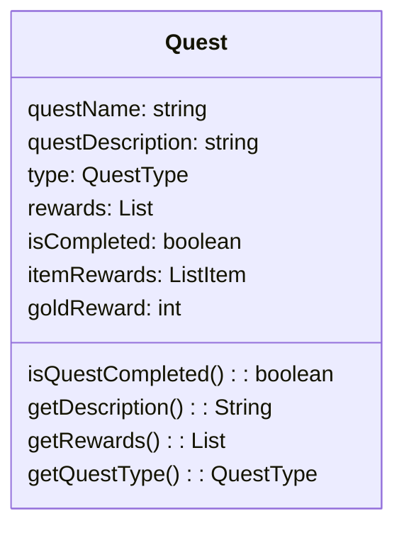

```mermaid
classDiagram
    class Quest {
        questName: string
        questDescription: string
        type: QuestType
        rewards: List
        isCompleted: boolean
        itemRewards: ListItem
        goldReward: int
        isQuestCompleted(): boolean
        getDescription(): String
        getRewards(): List
        getQuestType(): QuestType
    }
```