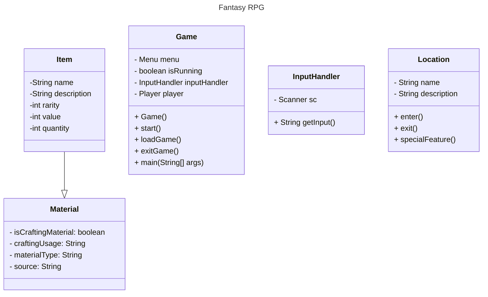

```mermaid
---
title: Fantasy RPG
---
classDiagram
    Item --|> Material
    class Material {
        - isCraftingMaterial: boolean
        - craftingUsage: String
        - materialType: String
        - source: String
    }

    class Item{
        -String name
        -String description
        -int rarity
        -int value
        -int quantity
    }

    class Game{
        - Menu menu
        - boolean isRunning
        - InputHandler inputHandler
        - Player player
        + Game()
        + start()
        + loadGame()
        + exitGame()
        + main(String[] args)
    }

    class InputHandler{
        - Scanner sc
        + String getInput()
    }

    class Location {
        - String name
        - String description
        + enter()
        + exit()
        + specialFeature()
    }

```
