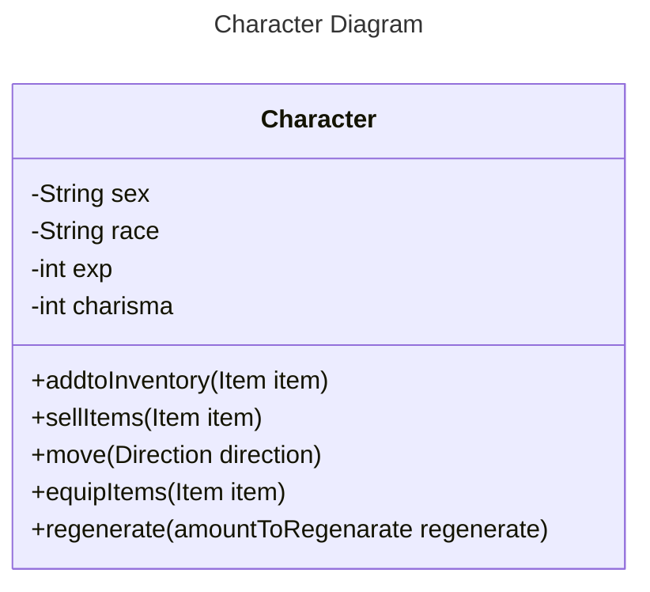

```mermaid
---
title: Character Diagram
---
classDiagram
class Character{
    -String sex
    -String race
    -int exp
    -int charisma
    +addtoInventory(Item item)
    +sellItems(Item item)
    +move(Direction direction)
    +equipItems(Item item)
    +regenerate(amountToRegenarate regenerate)

    }
```