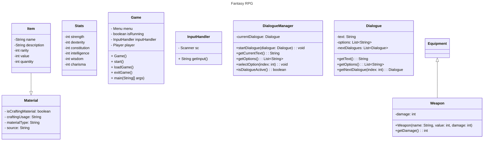

```mermaid
---
title: Fantasy RPG
---
classDiagram
    Item --|> Material
    class Material {
        - isCraftingMaterial: boolean
        - craftingUsage: String
        - materialType: String
        - source: String
    }

    class Item{
        -String name
        -String description
        -int rarity
        -int value
        -int quantity
    }
    
    class Stats{
 	-int strength
	-int dexterity
	-int constitution
	-int intelligence
	-int wisdom
	-int charisma
    }

    class Game{
        - Menu menu
        - boolean isRunning
        - InputHandler inputHandler
        - Player player
        + Game()
        + start()
        + loadGame()
        + exitGame()
        + main(String[] args)
    }

    class InputHandler{
        - Scanner sc
        + String getInput()
    }

    class DialogueManager {
        -currentDialogue: Dialogue
        +startDialogue(dialogue: Dialogue): void
        +getCurrentText(): String
        +getOptions(): List~String~
        +selectOption(index: int): void
        +isDialogueActive(): boolean
    } 

    class Dialogue {
        -text: String
        -options: List~String~
        -nextDialogues: List~Dialogue~
        +getText(): String
        +getOptions(): List~String~
        +getNextDialogue(index: int): Dialogue
    }

    Equipment <|-- Weapon
    class Weapon {
        -damage: int
        +Weapon(name: String, value: int, damage: int)
        +getDamage(): int
    }

```
