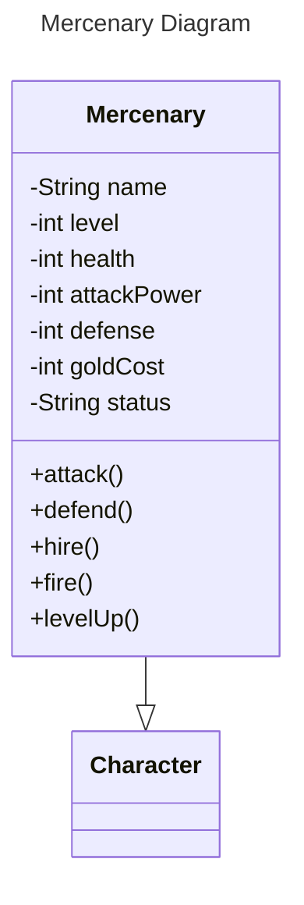

```mermaid
---
title: Mercenary Diagram
---

classDiagram
direction TB
    class Mercenary {
	    -String name
	    -int level
	    -int health
	    -int attackPower
	    -int defense
	    -int goldCost
	    -String status
	    +attack()
	    +defend()
	    +hire()
	    +fire()
	    +levelUp()
    }

    Mercenary --|> Character

```
