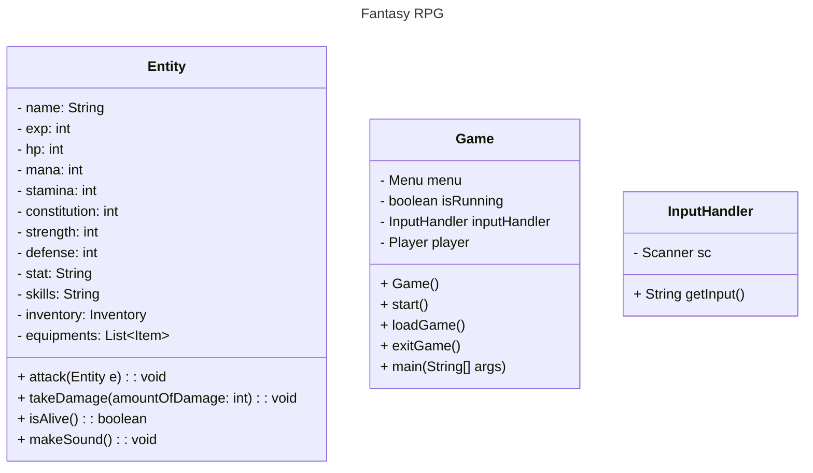

```mermaid
---
title: Fantasy RPG
---
classDiagram  
    class Entity{
      - name: String
      - exp: int
      - hp: int
      - mana: int
      - stamina: int
      - constitution: int
      - strength: int
      - defense: int
      - stat: String
      - skills: String
      - inventory: Inventory
      - equipments: List~Item~
      + attack(Entity e): void
      + takeDamage(amountOfDamage: int): void
      + isAlive (): boolean
      + makeSound(): void
    }

    class Game{
        - Menu menu
        - boolean isRunning
        - InputHandler inputHandler
        - Player player
        + Game()
        + start()
        + loadGame()
        + exitGame()
        + main(String[] args)
    }

    class InputHandler{
        - Scanner sc
        + String getInput()
    }
```
