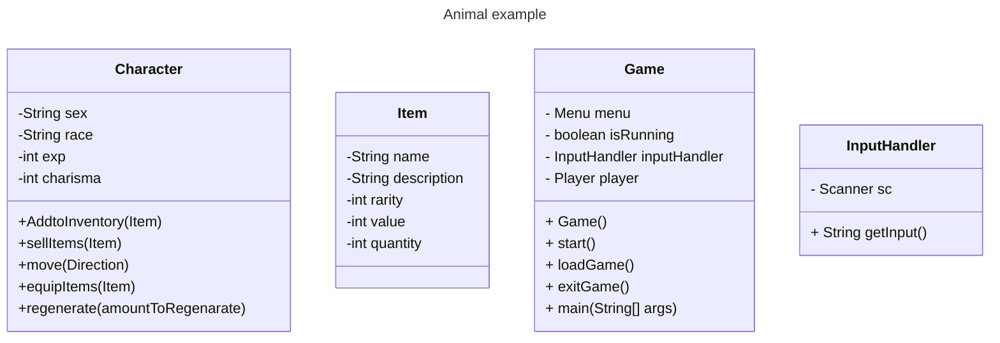

```mermaid
---
title: Animal example
---
classDiagram
    class Character{
    -String sex
    -String race
    -int exp
    -int charisma
    +AddtoInventory(Item)
    +sellItems(Item)
    +move(Direction)
    +equipItems(Item)
    +regenerate(amountToRegenarate)
    }

    class Item{
        -String name
        -String description
        -int rarity
        -int value
        -int quantity
    }

    class Game{
        - Menu menu
        - boolean isRunning
        - InputHandler inputHandler
        - Player player
        + Game()
        + start()
        + loadGame()
        + exitGame()
        + main(String[] args)
    }

    class InputHandler{
        - Scanner sc
        + String getInput()
    }
```

