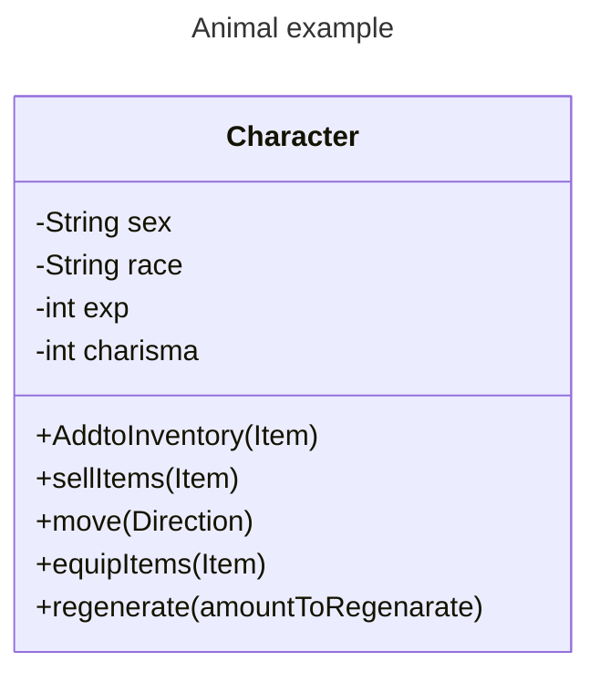

```mermaid
---
title: Animal example
---
classDiagram
    class Character{
    -String sex
    -String race
    -int exp
    -int charisma
    +AddtoInventory(Item)
    +sellItems(Item)
    +move(Direction)
    +equipItems(Item)
    +regenerate(amountToRegenarate)
    }
```