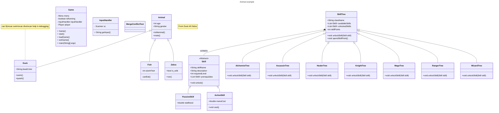

```mermaid
---
title: Animal example
---
classDiagram
    note "From Duck till Zebra"
    Animal <|-- Duck
    note for Duck "can fly\ncan swim\ncan dive\ncan help in debugging"
    Animal <|-- Fish
    Animal <|-- Zebra
    Animal : +int age
    Animal : +String gender
    Animal: +isMammal()
    Animal: +mate()
    class Duck{
        +String beakColor
        +swim()
        +quack()
    }
    class Fish{
        -int sizeInFeet
        -canEat()
    }
    class Zebra{
        +bool is_wild
        +run()
    }

    class Game{
        - Menu menu
        - boolean isRunning
        - InputHandler inputHandler
        - Player player
        + Game()
        + start()
        + loadGame()
        + exitGame()
        + main(String[] args)
    }

    class InputHandler{
        - Scanner sc
        + String getInput()

    }
    
    class MergeConflictTest{

    }

    class Skill {
        <<Abstract>>
        +String skillName
        +String description
        +int requiredLevel
        +List~Skill~ prerequisites
        +void unlock()
    }

    class SkillTree {
        +String className
        +List~Skill~ availableSkills
        +List~Skill~ unlockedSkills
        +int skillPoints
        +void unlockSkill(Skill skill)
        +void spendSkillPoint()
    }

    class PassiveSkill {
        +double statBoost
    }
    
    class ActiveSkill {
        +void cast()
        +double manaCost
    }

    Skill <|-- PassiveSkill
    Skill <|-- ActiveSkill

    SkillTree *-- Skill : contains

    class AlchemistTree {
        +void unlockSkill(Skill skill)
    }
    class AssassinTree {
        +void unlockSkill(Skill skill)
    }
    class HealerTree {
        +void unlockSkill(Skill skill)
    }
    class KnightTree {
        +void unlockSkill(Skill skill)
    }
    class MageTree {
        +void unlockSkill(Skill skill)
    }
    class RangerTree {
        +void unlockSkill(Skill skill)
    }
    class WizardTree {
        +void unlockSkill(Skill skill)
    }

    SkillTree <|-- AlchemistTree
    SkillTree <|-- AssassinTree
    SkillTree <|-- HealerTree
    SkillTree <|-- KnightTree
    SkillTree <|-- MageTree
    SkillTree <|-- RangerTree
    SkillTree <|-- WizardTree
```