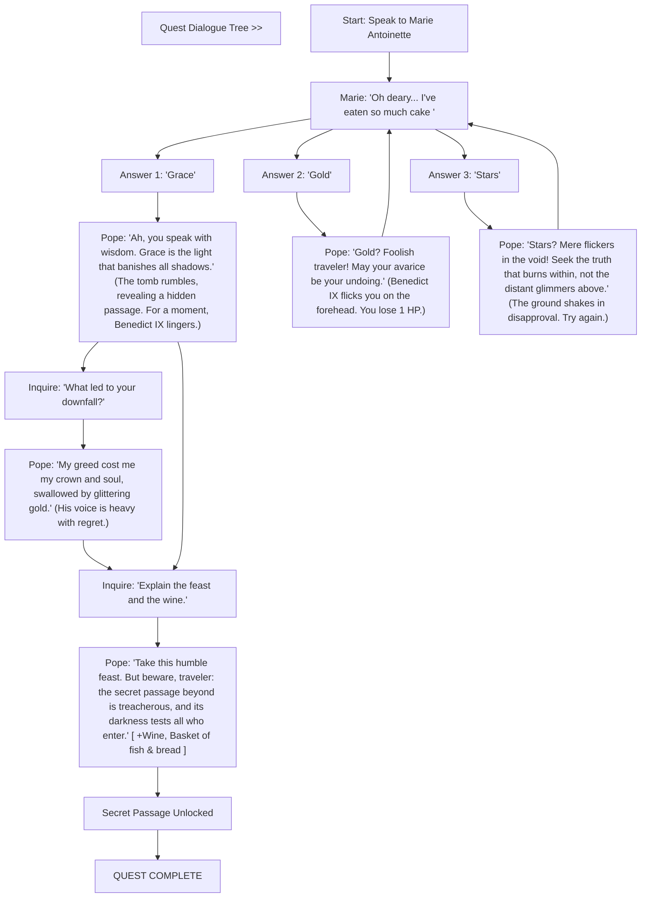
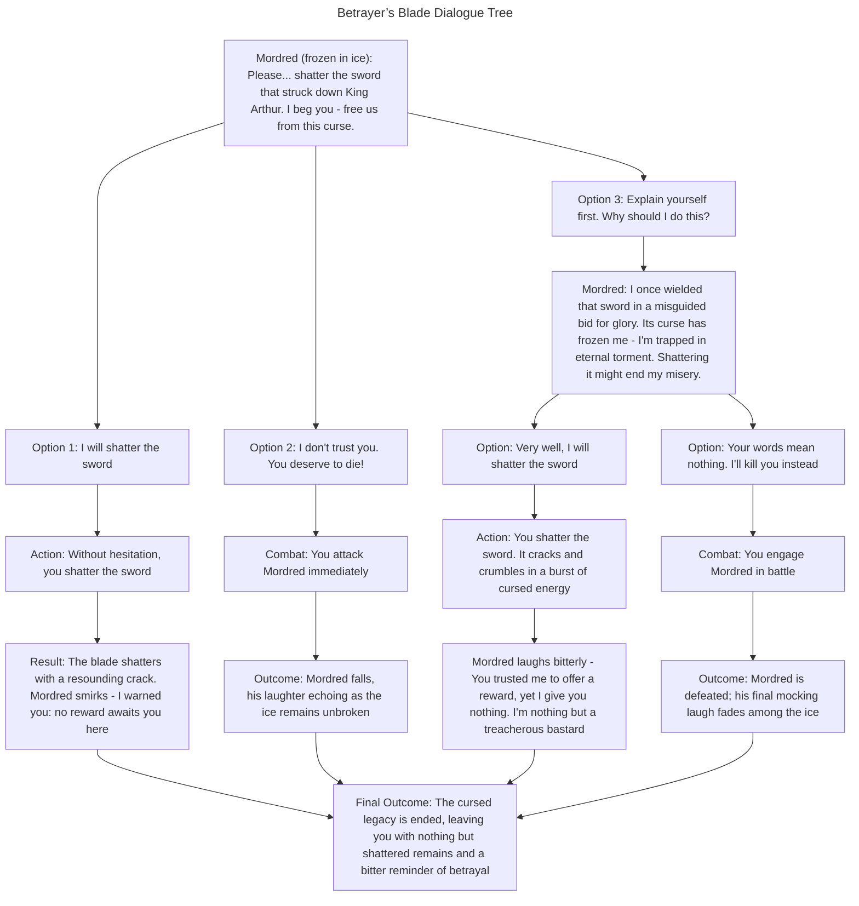

# Main Quest

# Sub Quest
1. "Grandfather's Hammer"
Quest Type: Find/Collect  
Description: Baelin the Fisherman speaks of his grandfather, who was once a blacksmith. He lost his grandfather's hammer around his tool shed and asks you to find it for him.  
Rewards:  
- Väinämöinen’s Fishing Rod  
- +2 Pike Fish (Raw)  

---

2. "The Lost Epic"
Quest Type: Listen  
Description: The great poet Homer has forgotten the ending of one of his epics. He asks you to recite any tale of heroism to help him remember.  
Rewards:  
- 2 Pieces of Parchment  
- A fragment of an ancient poem:  
  > "Upon the wine-dark sea he sailed, alone,  
  > Where silver mist entwined the oar’s lament.  
  > Beyond the isles where dawn’s first embers shone,  
  > To lands where gods and mortals never went."  

---

3. "A Lover’s Regret"
Quest Type: Collect  
Description: Paris, tormented by guilt, seeks a single red rose from [location TBD] to place on Helen’s grave.  
Rewards:  
- "The Heelpiercer" – Paris' bow, which he used to kill Achilles  
- Fire Resistant Condom  

---

4. "The Pope’s Sin"
Quest Type: Riddle  
Description: A sinful, forgotten pope, Benedict IX, who sold the Papacy for gold, is cursed to speak only in riddles. Solve his puzzle about Heaven and Hell to uncover a hidden path.  
Rewards:  
- Access to a secret passage  
- One bottle of wine  
- A basket of fish and bread  

---

5. "A Feast for the Damned"
Quest Type: Collect  
Description: Marie Antoinette, wallowing in filth and regret, asks you to bring her a single piece of real bread to prove that excess is no longer her fate.  
Rewards:  
- "Humble Crumb" – An item that restores HP when used, but only once per day.

---

6. "Blood of the Battlefield"
Quest Type: Collect  
Description: The legendary general Sun Tzu asks you to retrieve the bloodied blade of his fallen warrior to prove that wisdom can outlast war.  
Rewards:  
- A small clay figure that looks like a miniature version of a soldier from the Terracotta Army  
- A bag of Jade Tea leaves  

---

7. "The Emperor’s Gambit"
Quest Type: Kill  
Description: Frederick II, imprisoned in [location TBD] for heresy, demands you slay a demonic inquisitor who betrayed him.  
Rewards:  
- "The Atheist’s Dagger" – A dagger that represents Frederick II's defiance of religious authority (Deals extra damage to Holy Warriors)  

---

8. "The Unseen Chains"
Quest Type: Listen  
Description: The philosopher Hypatia speaks of knowledge lost to time. Listen to her tale, and she will grant you insight into hidden truths.  
Rewards:  
- 5 minutes of wasted time, but you have now learned about [knowledge TBD]. Congratulations, you have new conversational topics!  

---

9. "A Flatterer’s Curse"
Quest Type: Collect  
Description: Thais, condemned for flattery, needs you to bring her a mirror so she can see the filth she’s covered in.  
Rewards:  
- "Magic Mirror" – You don't know how it's magical, but on the back, it's engraved with "Made by Re-Logic."  

---

10. "Betrayer’s Blade"
Quest Type: Kill  
Description: Mordred, frozen in ice, begs you to shatter the sword that once struck down King Arthur.  
Rewards:  
- Nothing. He laughs at you, saying that he's a treacherous bastard and asks why you trusted him to give you a reward. He’s also still frozen in ice…

=======
## Sample quest

### **Quest: The Missing Heirloom**

**Objective:**
A villager has lost a valuable family heirloom in the nearby forest. The player is asked to retrieve it.

**Quest Start:**
- **NPC**: “I’ve lost a precious heirloom in the forest. It’s a locket that belonged to my grandmother. Can you help me find it?”

**Steps:**
1. **Explore the Forest**: The player must navigate through the forest to find the locket.
2. **Solve a Puzzle**: The locket is hidden under a tree stump, which has a riddle inscribed on it.
   - **Riddle**: “I can be cracked, made, told, and played. What am I?” (Answer: A joke)
3. **Find the Locket**: After solving the riddle, the player finds the locket.

**Completion:**
- **NPC**: “Thank you so much! You’ve returned the heirloom. Here’s a reward of 50 gold coins and my deepest gratitude.”

**Outcome:**
- Player receives 50 gold coins and a boost in reputation with the village.

# Sub Quest

